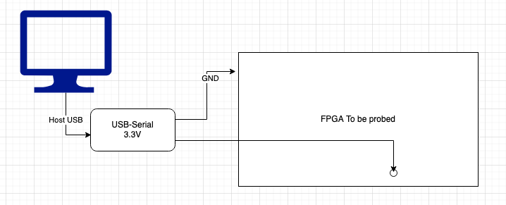
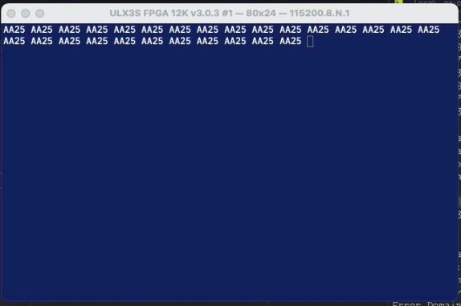

# Chisel FPGA Pin Finder

The idea for this project came from RISC-V Brasil Telegram list (thanks [@racerxdl](https://github.com/racerxdl) and [@samsoniuk](https://github.com/samsoniuk)) for a wish to map the unidentified pins on the Storey Peak Stratix V FPGA board.



The module uses a Serial TX attached to each pin you want to find printing to it it's name. One can then take a USB-Serial module connected to the computer USB and a serial console (115200 8N1) open then go probing each of the "guessed" pin. If the terminal prints the pin name, you found it.



To configure, add the pins to the IO section and constraints file and instantiate the PinFinder class in that pin.

It was tested on a Radiona ULX3S (where I already knew some pins) and then on the Storey Peak LED pins (that were already known too).

Next the idea is to map the other pins like PCIe, QSFP control pins and etc.

Quick demo:

[](https://youtu.be/0Ij2CQuhhj4)

## Usage

The project can be used to map any unknown pins on an FPGA where it's location in the PCB is not known but accessible for a probe. One can select pins from a bank, configure in this tool and probe the PCB to search the pin.

Select the pins to be testes (likely from a known bank), as trial-and-error, add it to the `Toplevel.scala` file like:

```scala
val io = IO(new Bundle {
    // Add pins here like:
    val A10  = Output(UInt(1.W)) // The pin name must match the constraints file in the format io_NAME. Eg. io_A10.

// Then instantiate the pinfinder for that pin
new PinFind("A10 ", io.A10, frequency, baudRate)
```

Then add to the constraints (for Quartus as example):

```tcl
set_location_assignment PIN_AW26 -to io_AW26
set_instance_assignment -name IO_STANDARD "2.5 V" -to io_AW26
set_instance_assignment -name SLEW_RATE 0 -to io_AW26
set_instance_assignment -name CURRENT_STRENGTH_NEW 8MA -to io_AW26
```

Then build the module and program to the FPGA. After programming, go "poking" the pins with the probe attached to a serial RX in the terminal (could be Putty, Minicom, etc) to try to identify the configured pins.

## Building

The first and recommended is using [Fusesoc](https://github.com/olofk/fusesoc), a package manager that handles all board backend files and configuration. It also makes adding support to new boards and vendors much easier.

### Fusesoc build and generation

To install Fusesoc (requires Python3 and pip3):

```sh
pip3 install --upgrade --user fusesoc

export PATH=~/.local/bin:$PATH
```

Check if it's working:

```sh
$ fusesoc --version
1.12.0
```

To generate the programming files for the **ULX3s**, first adjust the comments on `Toplevel.scala` file (pins on IO, pins to be scanned and the clock in the end of the file).

```sh
mkdir fusesoc-chiselblinky && cd fusesoc-chiselblinky

fusesoc library add fusesoc-cores https://github.com/fusesoc/fusesoc-cores
fusesoc library add pinfinder https://github.com/carlosedp/chisel-fpga-pinfinder

# Download the container command wrapper
wget https://gist.github.com/carlosedp/c0e29d55e48309a48961f2e3939acfe9/raw/bfeb1cfe2e188c1d5ced0b09aabc9902fdfda6aa/runme.py
chmod +x runme.py

# Run fusesoc with the wrapper as an environment var
EDALIZE_LAUNCHER=$(realpath ../runme.py) fusesoc run --target=ulx3s_85 carlosedp:demo:pinfinder

# Program to ULX3S
ujprog ./build/carlosedp_demo_pinfinder_0/ulx3s_85-trellis/carlosedp_demo_pinfinder_0.svf
```

For the Storey Peak board, run:

```sh
fusesoc run --target=storey_peak_stratixV --setup carlosedp:demo:pinfinder
```

This will generate the base files, `cd` into the generated directory (`./build/carlosedp_demo_pinfinder_0/storey_peak_stratixV-quartus`) in the machine Quartus is installed and run `make project`. Open the `carlosedp_demo_pinfinder_0.qpf` project for synthesize and PnR. Then program to the FPGA.

The board can be programmed with the [JTAG to Quartus](https://github.com/j-marjanovic/jtag-quartus-ft232h) driver.
